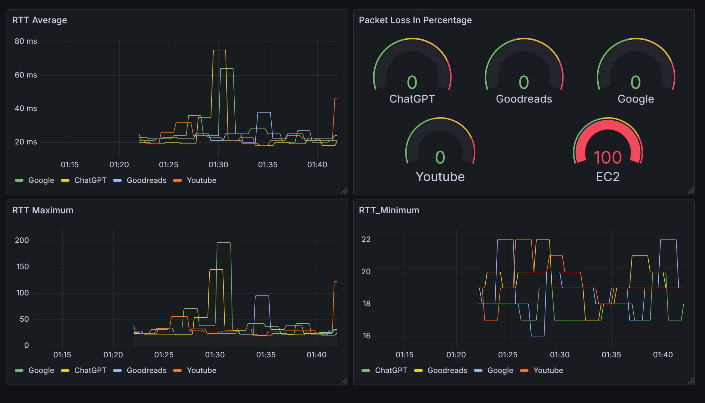

# 🛠️ Synthetic Monitoring Platform

This project was developed as part of the **Build Fellowship** offered by **Open Avenue**, under the mentorship of **Sonu Gupta**. The primary aim is to monitor the health, availability, and performance of websites (or web servers) in real-time, ensuring they are accessible and responsive to users.

The platform uses:
- **Python** to perform website monitoring and expose metrics.
- **Prometheus** to scrape these metrics periodically.
- **Grafana** for a real-time visualization dashboard.

---

## ✨ Features

- 🔍 Monitors websites for:
  - Uptime
  - Response time
  - HTTP status codes
- 📊 Exposes metrics in **Prometheus** format at `http://localhost:8989/metrics`
- 📈 Real-time **Grafana dashboard** for visualizing performance
- ⚙️ Configurable website list

---

## 🔧 Prerequisites

- Python 3.6+
  - Libraries: `requests`, `prometheus_client`
- [Prometheus](https://prometheus.io/) (v3.4.0-rc.0 or later)
- [Grafana](https://grafana.com/)
- Windows OS (but easily adaptable to Linux/macOS)
- AWS EC2 (optional): To monitor a hosted instance (e.g., `http://184.72.155.124`)

---

## 🛠️ Installation

### Install Dependencies

pip install requests prometheus_client

### Configure and Run Script
ping_monitor.py

Metrics will be available at: http://localhost:8989/metrics

### Configure and Run Prometheus
prometheus.yml

Run: cd C:\Users\HP\prometheus-3.4.0-rc.0.windows-amd64\prometheus-3.4.0-rc.0.windows-amd64
prometheus.exe --config.file=prometheus.yaml

Access Prometheus UI: http://localhost:9090

### Configure and Run Grafana

Run: cd "C:\Program Files\GrafanaLabs\grafana\bin"
grafana-server.exe

Default URL: http://localhost:3000 (Default_login: admin / admin)

### Add Prometheus as Data Source to Grafana

Go to Configuration > Data Sources > Add data source

Choose Prometheus

Set URL to http://localhost:9090

Click Save & Test

## Port Used

| Port | Purpose                 |
| ---- | ----------------------- |
| 8989 | Python metrics endpoint |
| 9090 | Prometheus UI           |
| 3000 | Grafana dashboard       |
